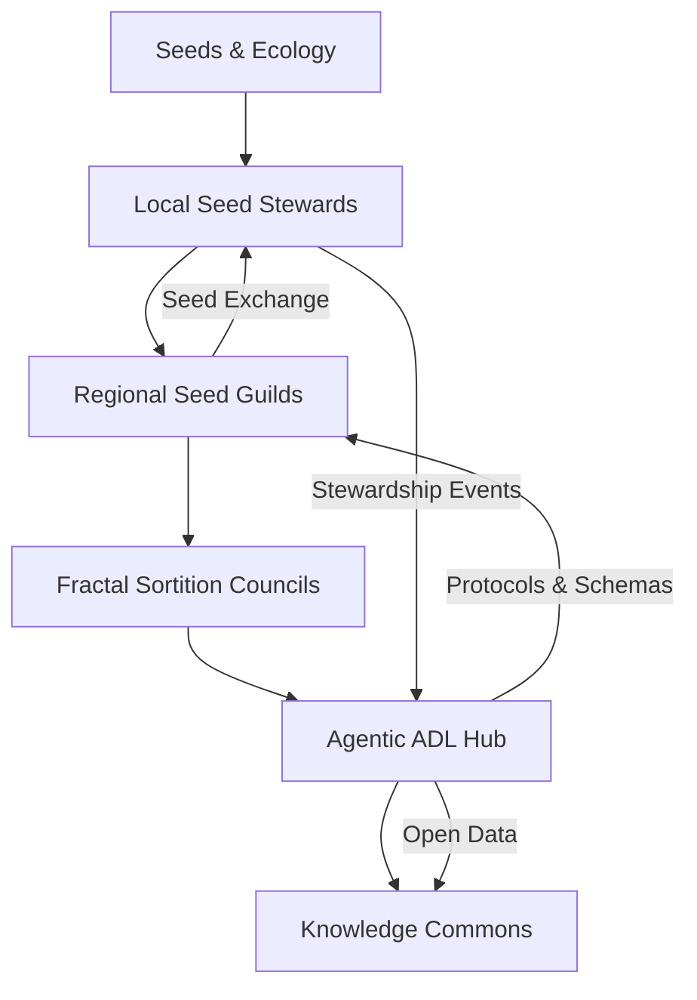
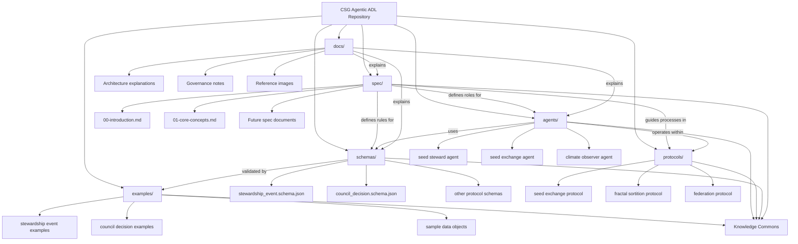
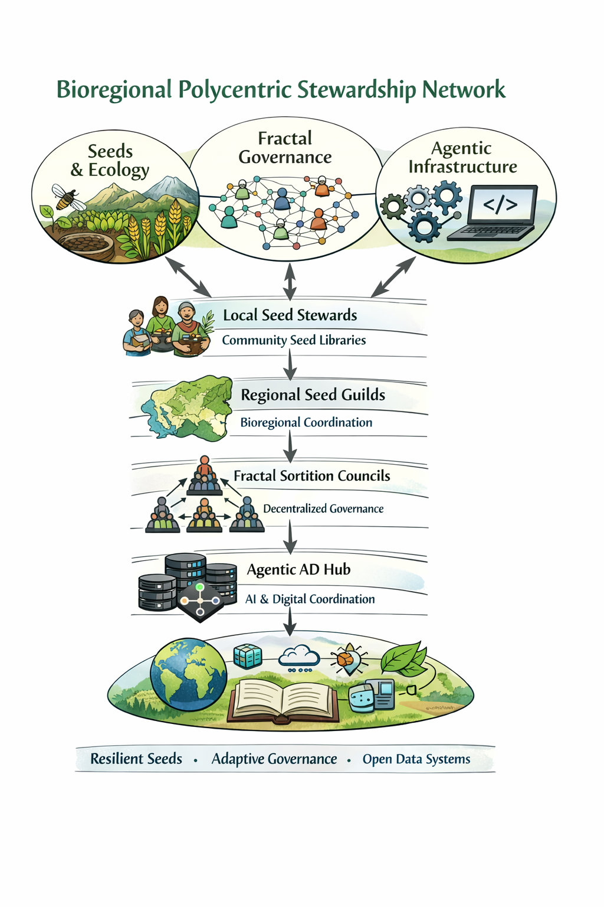

# csg-agentic-adl
Open schemas, protocols, and agent definitions for bioregional seed stewardship, fractal governance, and federated ecological coordination. This repository explores a polycentric stewardship architecture combining
seed ecology, fractal governance, and agent-based coordination systems.  It is important to keep in mind that a very large seed collection/system is physically underpinning this whole initiative.
## Repository Overview
- Protocol specification → spec/
- Architecture docs → docs/
- Data schemas → schemas/
- Agent definitions → agents/
- Example data → examples/
## Architecture (Mermaid Overview Diagram)

## Repository Architecture Full Diagram

## Seed Infrastructure Protocol
The Seed Infrastructure Protocol defines an open framework for
coordinating distributed seed stewardship networks and ecological data systems.

The formal protocol specification can be found in:

- [Seed Infrastructure Protocol Introduction](spec/00-introduction.md)
- [Core Concepts](spec/01-core-concepts.md)
## Architecture Overview

# CSG Agentic ADL

A lightweight open repository for defining agent-readable stewardship protocols, event schemas, and governance patterns for bioregional seed networks.

This project is being developed in relation to:

- Cascadia Seed Guild
- bioregional seed stewardship
- Fractal Sortition governance experiments
- agentic coordination infrastructure
- open ecological data systems

## Purpose

The goal of this repository is to define a shared language that can be used by:

- human seed stewards
- community seed libraries
- regional seed guilds
- software agents
- federated governance systems
- ecological monitoring tools

This is not a central control system.

It is a coordination layer.

The purpose is to help distributed networks share information, stewardship actions, and governance outcomes in a transparent, portable, and machine-readable way.

## Core design principles

1. Humans remain the stewards.
2. Agents assist with coordination, recordkeeping, and pattern detection.
3. Ecological diversity is treated as resilience infrastructure.
4. Governance should be distributed, auditable, and adaptive.
5. Bioregions matter more than administrative borders for ecological stewardship.
6. Open standards are preferable to proprietary lock-in.

## Main components

### 1. Schemas
JSON schemas define shared structures for:
- seed accessions
- stewardship events
- bioregions
- council decisions

### 2. Agent Definitions
ADL files describe:
- agent role
- inputs
- outputs
- actions
- constraints
- trust boundaries

### 3. Protocols
Human-readable governance and exchange protocols describe:
- seed exchange norms
- fractal sortition process
- federation between guilds and repositories

## Suggested use cases

- recording seed saving events
- tracking local adaptation notes
- coordinating community seed exchanges
- logging pollinator observations
- reporting climate anomalies relevant to seed work
- publishing council decisions in machine-readable form
- integrating Perma-Ledger / farmOS data into federated systems

## Repository status

Early-stage conceptual infrastructure.

This repository is intended as a living commons for experimentation, refinement, and practical deployment in seed-based resilience networks.

## Initial vision

Seeds -> Local Stewards -> Regional Guilds -> Fractal Governance -> Agentic Coordination -> Knowledge Commons

## Contributing

At this stage, contributions should prioritize:
- clarity
- interoperability
- low complexity
- ecological usefulness
- governance transparency

## License

See LICENSE.
