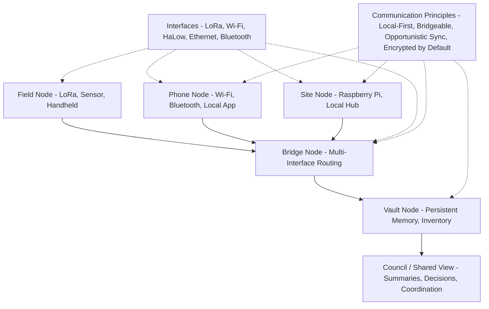

# Communication Layer

This diagram shows how Lichen nodes communicate across heterogeneous interfaces using local-first routing, bridge nodes, and opportunistic synchronization.

```mermaid
flowchart TB

    N1["Field Node - LoRa, Sensor, Handheld"]
    N2["Phone Node - Wi-Fi, Bluetooth, Local App"]
    N3["Site Node - Raspberry Pi, Local Hub"]
    N4["Bridge Node - Multi-Interface Routing"]
    N5["Vault Node - Persistent Memory, Inventory"]
    N6["Council / Shared View - Summaries, Decisions, Coordination"]

    N1 --> N4
    N2 --> N4
    N3 --> N4
    N4 --> N5
    N5 --> N6

    I["Interfaces - LoRa, Wi-Fi, HaLow, Ethernet, Bluetooth"]
    I -.-> N1
    I -.-> N2
    I -.-> N3
    I -.-> N4

    P["Communication Principles - Local-First, Bridgeable, Opportunistic Sync, Encrypted by Default"]
    P -.-> N2
    P -.-> N3
    P -.-> N4
    P -.-> N5
```
