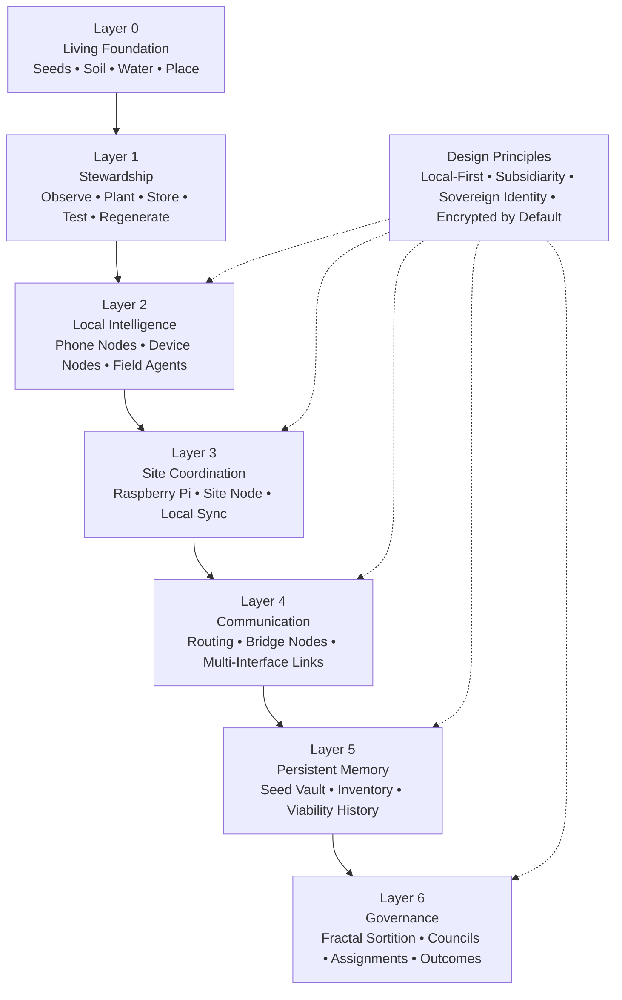

# Lichen Stack

This diagram presents the Lichen system as a layered, local-first architecture connecting living systems, local intelligence, communication, memory, and governance.

```mermaid
flowchart TB

    L0["Layer 0<br/>Living Foundation<br/>Seeds • Soil • Water • Place"]
    L1["Layer 1<br/>Stewardship<br/>Observe • Plant • Store • Test • Regenerate"]
    L2["Layer 2<br/>Local Intelligence<br/>Phone Nodes • Device Nodes • Field Agents"]
    L3["Layer 3<br/>Site Coordination<br/>Raspberry Pi • Site Node • Local Sync"]
    L4["Layer 4<br/>Communication<br/>Routing • Bridge Nodes • Multi-Interface Links"]
    L5["Layer 5<br/>Persistent Memory<br/>Seed Vault • Inventory • Viability History"]
    L6["Layer 6<br/>Governance<br/>Fractal Sortition • Councils • Assignments • Outcomes"]

    L0 --> L1 --> L2 --> L3 --> L4 --> L5 --> L6

    P["Design Principles<br/>Local-First • Subsidiarity • Sovereign Identity • Encrypted by Default"]
    P -.-> L2
    P -.-> L3
    P -.-> L4
    P -.-> L5
    P -.-> L6
```
